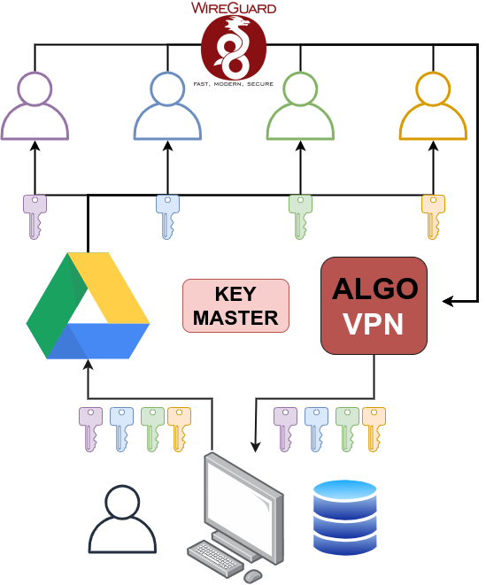
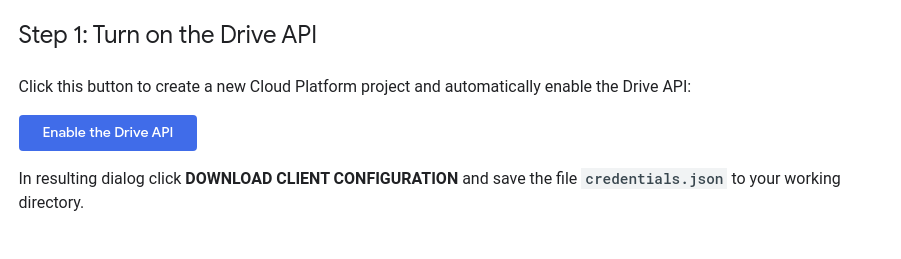

# Key Master - Making Key Distro for Algo Easy

Code Written by David Foran - Red Sun Information Systems Corporation

Code written in Python 3.6.9 according to PEP8 Standards. This code is a simple set up scripts that copy your Algo QR Keys/Config files for wireguard and transfer them into your 'escrow' folder, creating and moving them into a folder for each user. From there, the code is integrated into your Google Drive 'escrow' folder. The app will automatically create the folders once the main script is run.

This code is to be used in conjunction with Algo/Wireguard. The Code to get an ALGO VPN started up is located [here](https://github.com/trailofbits/algo). Download the Algo folder directly into the main folder for this respository.

## Getting Started / Setup

### Setting Up Python Environment

As usual, I recommend you first clone this repository and set up a Virtual Environment and enter into it with a set of commands like:

    git clone <url>

    python3 -m venv <environment name>

    source <environment name>/bin/activate

You'll need to install the required python3 modules.

Using pip3 for python3. Upon activating your environment run:

    pip3 install -r requirements.txt

Finally, you will have to activate your gsuite account.

In order for the code to work you do need a Credential File which can be obtained by going to the following link:

    Drive API (https://developers.google.com/drive/api/v3/quickstart/python)

From there click on the following button:

Then, download the credentials from the popup:

These credentials should be placed into the administrative folder. There are dummy files located in the administrative folder for show. Rename the credentials "client_secrets.json" then you can move on and begin using the program.

The command to run the program is:

    python3 distribute_keys.py

Note that once distribution begins, you'll need to add emails for all new users that are getting added to the list. If the program detects keys uploaded for a username that doesn't currently exist, it will prompt you for their email. All username / email keypairs are stored locally in an sqlite3 database.

## Authors

* **Dave Foran** - [RedSunDave](https://github.com/RedSunDave)

## License

This project is licensed under the GPLv3 License

## Acknowledgments

* Please reach out to me with any questions that you have at dave@redsunis.com, I am always excited to see projects you are working on! If you have any recommendations on improving the code or formatting, please let me know as well.

* If you copy, please include this info